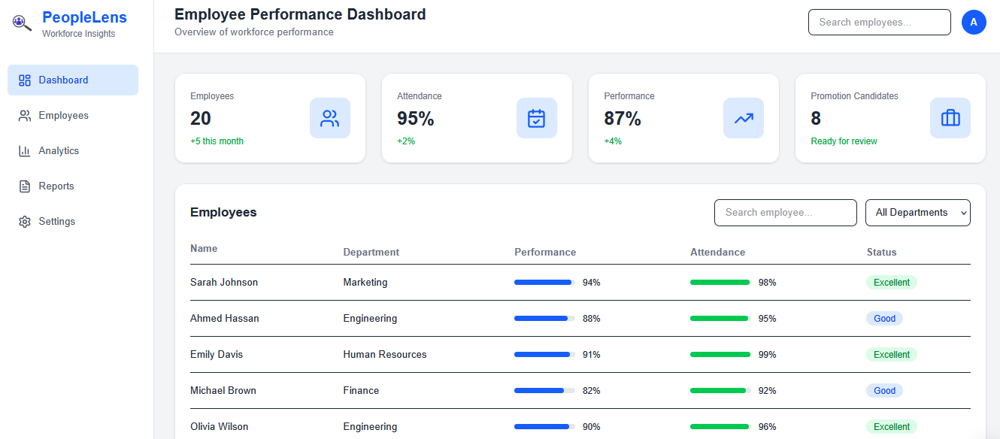
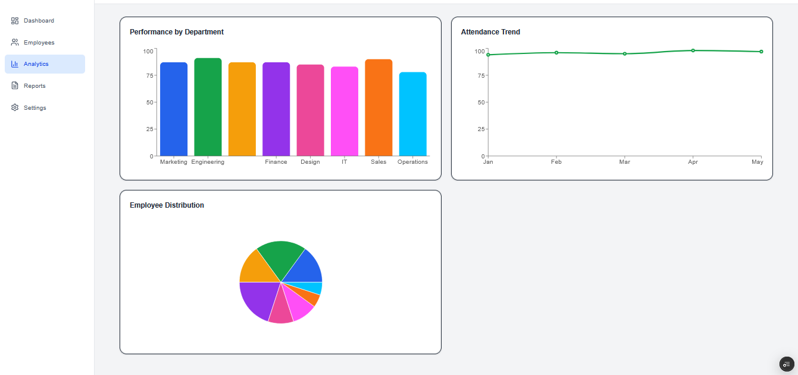
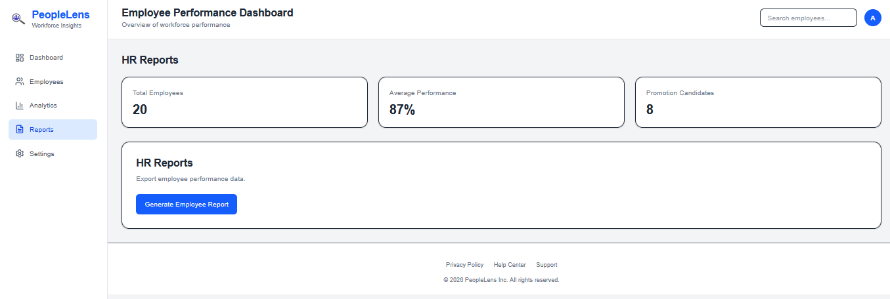

<h1>
  
  PeopleLens
</h1>

## HR Analytics Platform

PeopleLens is a SaaS-style HR analytics dashboard designed to help organizations visualize workforce insights, track employee performance, and support data-driven HR decisions.

The project simulates an HR management platform with interactive dashboards, employee analytics, reports, and account management features.

---

## Features

### Dashboard
- Overview of workforce metrics
- Employee count tracking
- Attendance insights
- Performance summaries
- Promotion candidate tracking

### Employee Management
- View employee records
- Browse workforce information
- Track employee performance data

### Analytics
- Department performance visualization
- Attendance trends
- Employee distribution charts

### Reports
- HR statistics overview
- Report generation interface
- Workforce insights

### User Experience
- Interactive sidebar navigation
- Admin profile menu
- Settings panel
- Privacy, Help Center, and Support sections

---
<h2>Screenshots</h2>

<h3>Dashboard</h3>

<h3>Analytics</h3>

<h3>Reports</h3>

---
## Built With

- **Next.js** — React framework for production applications
- **TypeScript** — Type-safe development
- **Tailwind CSS** — Responsive UI styling
- **Recharts** — Data visualization
- **Lucide React** — Interface icons

---

## Purpose

PeopleLens was created as a portfolio project to demonstrate skills in:

- Frontend application development
- Dashboard and UI design
- Data visualization
- Information systems concepts
- HR technology solutions

---

## Future Improvements

- Real authentication system
- Database integration
- Role-based access control
- Advanced HR reports
- AI-powered employee insights
